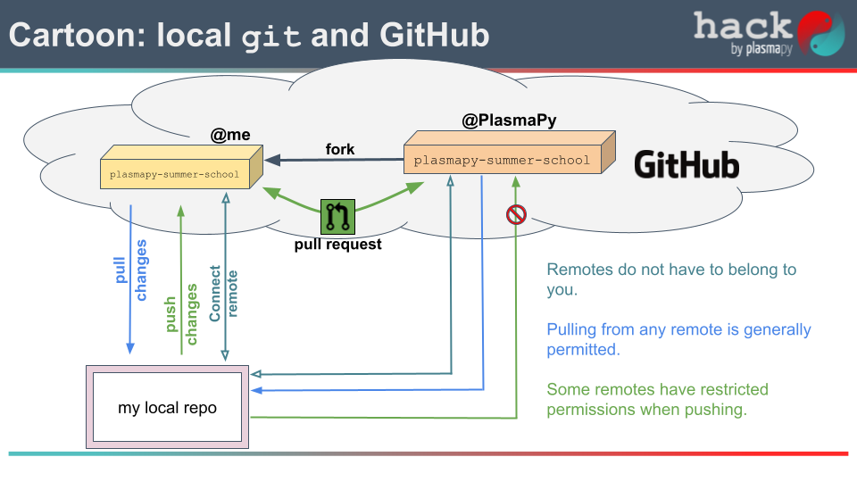

# PlasmaPy Summer School 2024

[](https://plasmapy-summer-school.readthedocs.io/en/latest/?badge=latest)

## Contents

- [Example Notebooks](#example-notebooks)
- [Tips](#tips)
  - [Running tests](#running-tests)
  - [Building documentation](#building-documentation)
  - [`git` and GitHub](#git-and-github)
  - [Contributing to the Formulary](#contributing-to-the-formulary)

## Example notebooks

Here are links to use the notebooks.

 - [Astropy Units](https://colab.research.google.com/github/PlasmaPy/plasmapy-summer-school/blob/main/notebooks/astropy-units.ipynb)
 - [PlasmaPy Particles and Formulary](https://colab.research.google.com/github/PlasmaPy/plasmapy-summer-school/blob/main/notebooks/particles-formulary.ipynb)
 - [New notebook](https://colab.research.google.com/github/PlasmaPy/plasmapy-summer-school/blob/main/notebooks/particles-formulary.ipynb)

## Tips

### Running tests

Run tests locally with:

```bash
nox -s tests
```

### Building documentation

Build documentation locally at:

```bash
nox -s docs
```

### `git` and GitHub

Simplified cartoon of the `git` and GitHub scheme.



### Contributing to the Formulary

At this point we assume you have already forked this repository and set
up  your local `git` repository.

1. Start by determining which formulary function you would like to add
   to the repo.  You can select from existing formulary functions
   contained in the [`plasmapy.formulary`](https://github.com/PlasmaPy/PlasmaPy/tree/main/src/plasmapy/formulary)
   or choose one of your own.
2. Back at your local `git` clone (on your personal computer) update the
   `main` branch.  This is the local branch that has its upstream set
   the `main` branch of the [`plasmapy-summer-school` repository](https://github.com/PlasmaPy/plasmapy-summer-school).
   This will ensure you are starting from the most up-to-date version
   of the repository.
3. Create a working branch from your updated `main` branch.  Name this
   working branch something explicitly descibing what you are adding.
   For example, name the working branch `add_gyroradius` for contributing
   a formulary function for the gyroradius.
4. Push an instance of your working branch to your GitHub fork of
   `plasmapy-summer-school`.
5. Now, add the code associated with your formulary function to the
   appropriate `.py` file located in the `./src/hack/formulary` directory.
   - As you develop your code try to make frequent, well focused commits.
     This is not a strict rule, but will help with debugging errors if,
     and when, they occur.
6. Push you commits to GitHub at a regular intervals.
7. When ready, open a Pull Request (PR) from your working branch on your
   fork to the `main` branch on the original repository.  For detailed
   instructions follow GitHub's instructions of
   [Creating a pull request from a fork](https://docs.github.com/en/pull-requests/collaborating-with-pull-requests/proposing-changes-to-your-work-with-pull-requests/creating-a-pull-request-from-a-fork).
